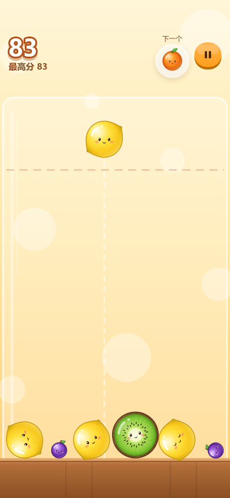
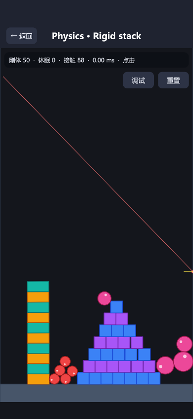

# minigame-engine

一个用 TypeScript 写的 2D 小游戏引擎，Canvas 2D 渲染。同一套代码可以打包成微信小游戏、抖音小游戏、TapTap 小游戏、233 乐园和 Web 版本。

它从一开始就是为 **AI 编码助手** 设计的：代码、美术（用代码绘制）、音乐音效（用代码合成）和 UI 都由 AI 编写，人只负责试玩和反馈。所以引擎里的每样东西都能从代码层面检查，比如节点树的文本输出、UI 检查报告，以及 AI 能直接查看的无头截图。

A TypeScript 2D game engine (Canvas 2D) for WeChat / Douyin / TapTap / 233 mini-games and the web, built so an AI coding agent can write, verify and ship a whole game: code, code-drawn art, synthesized audio and UI, checked through text dumps, UI lint and headless screenshots.

| 合成大西瓜（示例游戏） | 游戏中 | 刚体物理演示 |
|---|---|---|
|  |  |  |

## 功能

- **场景与节点**：场景图、CSS 风格的选择器查找节点（`Button#start.primary`、`A > B`）、`describe()` 文本输出、场景切换转场、固定步长更新
- **显示**：Graphics、精灵动画、九宫格、平铺精灵、粒子、遮罩、滤镜效果，纹理分辨率可按设备自动选择
- **UI**：flex 布局，按钮、滑块、开关、复选框、标签页、滚动列表、进度条等组件，`ui.*` 声明式构建器、弹窗和 Toast、主题。UI 检查会在多种机型上报告越界、遮挡、对比度不足、点击区域过小等问题
- **物理**：Box2D 风格的刚体物理 `RigidWorld`（旋转、堆叠、休眠、传感器、碰撞事件、射线检测），以及用于平台跳跃类游戏的街机物理
- **世界**：摄像机、瓦片地图、等距视角、深度排序、伪 3D 公路、寻路
- **手感**：缓动和计时器、震屏、弹跳、弹簧、挤压拉伸、瞄准手势（按下、滑动、松手）
- **输入**：触摸手势、虚拟摇杆、键盘、手柄，以及把按键、手柄、屏幕按钮统一映射成动作
- **音频**：用参数合成音效，用乐谱记法写音乐，导出 mp3；提供 AudioManager 和一行播放的快捷函数
- **美术**：调色板、像素画、SVG、形状、图标、噪声、图案、程序化生物、图集
- **其他**：多语言 `tr()`、本地存档、激励视频和插屏广告封装、资源加载
- **工具**：无头截图、真实 Chrome 截图、UI 检查、性能基准、调试面板（fps、耗时、节点数、纹理内存）、多平台构建和包体大小检查

## 快速开始

需要 Node.js（开发时用的是 v24）和 pnpm 11。

```bash
pnpm install
pnpm dev                    # 打开 http://localhost:5173 ，/frame 可以同屏看三台手机
pnpm dev --app sandbox      # 引擎功能演示场景
pnpm check                  # 类型检查 + 编码检查 + 全部测试
pnpm shot --scene play --device "iphone-se,iphone-14,ipad" --lint   # 无头截图 + UI 检查，输出到 .shots/
pnpm build --target all     # 打包 web / wx / tt / tap / 233 到 dist/
```

开发版地址加上 `?debug=1` 会打开调试面板，加上 `&stats=1` 会显示性能统计。

## 目录结构

| 路径 | 内容 |
|---|---|
| `engine/` | 引擎本体，通过 `@engine` 导入 |
| `game/` | 示例游戏：合成大西瓜 |
| `sandbox/` | 每个引擎模块的演示场景 |
| `tools/` | 开发服务器、构建、截图、音频渲染、性能基准、编码检查等命令行工具 |
| `tests/` | 引擎测试（其余测试放在代码旁边，文件名为 `*.test.ts`） |
| `AGENTS.md` | 给 AI 编码助手的项目指南：命令、约定和常见坑 |
| `.agents/skills/` | 11 份按主题划分的 AI 技能文档（做游戏、UI、美术、音频、手感、物理、输入与多语言、测试、性能、发布、扩展引擎） |

## 用 AI 开发

在 Cursor、Claude Code 或其他支持 `AGENTS.md` 的编码助手里打开这个仓库，直接用自然语言描述想做的游戏就行。助手会先读 `AGENTS.md` 和对应的 skill（例如 `.agents/skills/make-a-game/SKILL.md`），然后写代码，再用 `pnpm check`、`pnpm shot --lint` 和截图自行验证。

新增游戏的方法：在根目录建一个和 `game/` 结构相同的文件夹，把它加进 `tsconfig.json` 和 `vitest.config.ts`，然后用 `--app <文件夹>` 运行各个命令，或者把 `package.json` 里的 `engine.app` 改成它。

## 平台

| 目标 | 命令 | 说明 |
|---|---|---|
| Web | `pnpm build --target web` | 用于开发调试，也可以直接部署 |
| 微信小游戏 | `pnpm build --target wx` | 用微信开发者工具打开 `dist/wx` |
| 抖音小游戏 | `pnpm build --target tt` | 用抖音开发者工具打开 `dist/tt` |
| TapTap 小游戏 | `pnpm build --target tap` | 生成 `dist/tap.zip` |
| 233 乐园 | `pnpm build --target 233` | 需要团结引擎的小游戏转换器，没有时会跳过并提示安装方法 |

小游戏的 appid 和广告位 id 写在各个游戏的 `app.json` 里。仓库里默认留空，留空时用测试号运行，浏览器里会模拟广告。

## License

[MIT](LICENSE)
